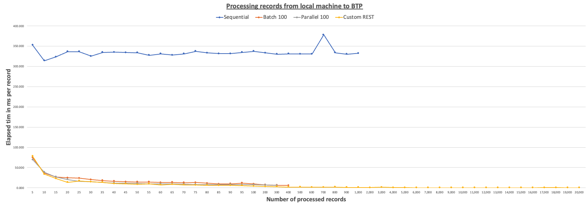
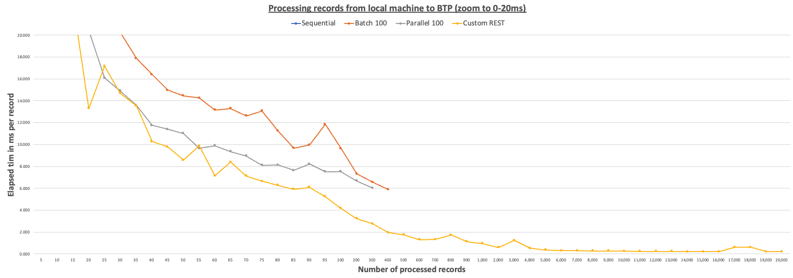

# Performance Results
This document summarizes a set of performance tests and the manner in which they were run. 

## Observations
- SAP CAP is a great framework to provide easy ODATA access to your data model.
- As expected, sequential single request processing is the slowest approach. The problem is amplified if you have to include network latency as a factor. 
-  Utilizing batch processing or parallel processing are good ways to improve performance, but require additional effort in tuning the connection pool. As our detailed test results show, the default connection pool settings are not optimal for high volume through put and lead to various errors (getaddrinfo ENOTFOUND, 502 - Bad Gateway, 503 - Service Unavailable).
- The custom REST endpoint approach is the fastest and most efficient approach, but requires additional effort to implement and maintain. In version 6.4 of CAP you must patch CAP to allow for larger request bodies. You can find details in the description of the [Reference Server](/RizInno/cds-load-refsrv)

## Test Setup
The performance results documented in here are based on the following test setup:
1. The 'local' test type was executed by running the refernce server and load-test client on the same machine. 
    - The reference server utilized the CAP provided sqlite in-memory database.
    - The machine used for the test was a Apple MacBook Pro M1 Max chip with 10-core CPU, 32-core GPU
    - Referenece Server SAP CAP release was 6.4

2. The 'btpfromlocal' test type was executed by running the Refeference Server in the BTP (Cloud Foundry) and the load-test client on the same machine we used for the local test. 
    - The reference server utilized the HANA Cloud database.
    - No special configuration (e.g. Connection Pool settings were made)
    - The machine used for the test was a Apple MacBook Pro M1 Max chip with 10-core CPU, 32-core GPU
    - Referenece Server SAP CAP release was 6.4

## Disclaimer
- This performance test does not represent a real world scenario or a scientific test.
- It can give you some benchmarks to compare your own results with and to get a feeling what approach is better for your use case.
- Performance optimizations and tuning should always be done specifically to your solution.

## Graphical
The graphical overview is limited to 4 test configurations that were run in the 'btpfromlocal' test test setup (see above).
1. **Sequential** test in which the load-test client sends 1 request after the other
2. **Batch Sequential** test in which the load-test client sends 100 requests per batch and waits for the response before sending the next batch
3. **Parallel** test in which the load-test client sends all requests in parallel through 100 connections. Once that number is reached the load-test client waits for the response from at least one request before sending the request to continuasly have a parallel load of 100 open requests.
4. **Custom REST** sends all data through a custom REST endpoint to be processed as one request in the Reference Server side.

### Overview 
This overview graphic shows the processing details you can find in the 'tabular' section below visualized in a simple line chart.

#### Zoom to 0-20 milliseconds

## Tabular
| Test Type    | Run             | Parallel Channels | Records in Batch | 5       | 10      | 15      | 20      | 25      | 30      | 35      | 40      | 45      | 50      | 55      | 60      | 65                                            | 70      | 75      | 80      | 85      | 90      | 95      | 100     | 200     | 300     | 400                                           | 500                                       | 600     | 700                                       | 800     | 900     | 1,000   | 2,000                             | 3,000 | 4,000                                         | 5,000 | 6,000 | 7,000 | 8,000                             | 9,000 | 10,000 | 11,000 | 12,000 | 13,000 | 14,000 | 15,000 | 16,000 | 17,000 | 18,000 | 19,000 | 20,000 |
| ------------ | --------------- | ----------------- | ---------------- | ------- | ------- | ------- | ------- | ------- | ------- | ------- | ------- | ------- | ------- | ------- | ------- | --------------------------------------------- | ------- | ------- | ------- | ------- | ------- | ------- | ------- | ------- | ------- | --------------------------------------------- | ----------------------------------------- | ------- | ----------------------------------------- | ------- | ------- | ------- | --------------------------------- | ----- | --------------------------------------------- | ----- | ----- | ----- | --------------------------------- | ----- | ------ | ------ | ------ | ------ | ------ | ------ | ------ | ------ | ------ | ------ | ------ |
| local        | sequential      | 1                 | 1                | 12.600  | 5.700   | 5.000   | 3.800   | 3.880   | 4.300   | 3.514   | 3.150   | 3.533   | 3.220   | 2.873   | 3.033   | 2.892                                         | 5.500   | 2.920   | 2.750   | 2.694   | 2.867   | 2.842   | 3.190   | 2.605   | 3.383   | 2.713                                         | 2.632                                     | 2.730   | 2.240                                     | 2.234   | 2.318   | 2.089   | 2.183                             | 2.206 | 2.188                                         | 2.270 | 2.344 | 2.318 | 2.316                             | 2.343 | 2.328  | 2.350  | 2.335  | 2.339  | 2.336  | 2.333  | 2.728  | 2.614  | 2.640  | 2.640  | 2.626  |
| local        | batchSequential | 1                 | 10               | 27.600  | 16.000  | 9.600   | 3.450   | 3.360   | 3.233   | 4.371   | 2.800   | 2.867   | 3.540   | 2.309   | 3.317   | 2.000                                         | 1.686   | 2.613   | 1.763   | 1.765   | 2.144   | 1.653   | 2.050   | 1.585   | 1.747   | 1.365                                         | 1.458                                     | 1.317   | 1.081                                     | 1.529   | 1.236   | 1.409   | 1.075                             | 0.892 | 0.800                                         | 0.787 | 1.016 | 0.836 | 0.972                             | 0.935 | 0.921  | 0.921  | 0.890  | 0.926  | 0.826  | 0.846  | 0.836  | 0.831  | 0.831  | 0.834  | 0.849  |
| local        | batchSequential | 1                 | 50               | 12.400  | 4.100   | 1.800   | 2.000   | 1.480   | 1.400   | 1.286   | 1.400   | 1.422   | 1.260   | 1.145   | 1.183   | 1.046                                         | 1.014   | 1.120   | 0.813   | 1.894   | 1.189   | 1.495   | 1.000   | 1.120   | 1.030   | 0.980                                         | 1.036                                     | 0.970   | 0.956                                     | 0.920   | 0.879   | 0.871   | 0.856                             | 0.863 | 0.853                                         | 0.851 | 0.821 | 0.798 | 0.803                             | 0.803 | 0.798  | 0.808  | 0.792  | 0.803  | 0.802  | 0.800  | 0.788  | 0.798  | 0.803  | 0.800  | 0.801  |
| local        | batchSequential | 1                 | 100              | 13.400  | 5.000   | 1.933   | 1.800   | 1.600   | 1.567   | 1.343   | 1.675   | 1.289   | 1.340   | 1.236   | 1.233   | 1.246                                         | 1.257   | 0.920   | 0.900   | 1.906   | 1.078   | 1.684   | 1.410   | 1.165   | 1.087   | 0.983                                         | 1.044                                     | 0.992   | 0.963                                     | 0.908   | 0.934   | 0.885   | 0.888                             | 0.915 | 0.899                                         | 0.850 | 0.805 | 0.829 | 0.798                             | 0.783 | 0.801  | 0.819  | 0.802  | 0.793  | 0.805  | 0.800  | 0.800  | 0.794  | 0.804  | 0.803  | 0.797  |
| local        | batchSequential | 1                 | 500              | 10.800  | 3.700   | 1.800   | 1.700   | 5.480   | 1.800   | 1.314   | 1.325   | 1.378   | 1.380   | 2.436   | 1.200   | 1.108                                         | 0.971   | 1.747   | 1.338   | 1.012   | 1.700   | 1.084   | 1.790   | 1.280   | 1.083   | 0.988                                         | 1.030                                     | 0.957   | 0.944                                     | 0.890   | 0.878   | 0.848   | 0.846                             | 0.815 | 0.825                                         | 0.831 | 0.815 | 0.805 | 0.796                             | 0.797 | 0.789  | 0.815  | 0.788  | 0.790  | 0.780  | 0.791  | 0.797  | 0.796  | 0.792  | 0.794  | 0.800  |
| local        | batchSequential | 1                 | 1000             | 11.800  | 4.100   | 1.933   | 1.900   | 1.440   | 1.467   | 1.343   | 1.450   | 1.267   | 1.280   | 0.982   | 1.250   | 1.169                                         | 1.000   | 1.120   | 0.775   | 1.812   | 1.167   | 1.653   | 0.990   | 1.175   | 1.003   | 0.958                                         | 1.074                                     | 0.998   | 0.944                                     | 0.915   | 0.896   | 0.856   | 0.834                             | 0.873 | 0.828                                         | 0.826 | 0.829 | 0.795 | 0.794                             | 0.799 | 0.790  | 0.798  | 0.790  | 0.796  | 0.811  | 0.794  | 0.797  | 0.802  | 0.810  | 0.792  | 0.800  |
| local        | parallel        | 10                | 1                | 13.600  | 4.200   | 2.867   | 2.550   | 7.680   | 2.033   | 2.257   | 2.225   | 2.067   | 4.220   | 2.109   | 2.500   | 3.815                                         | 1.886   | 1.853   | 3.275   | 1.859   | 3.356   | 1.832   | 2.990   | 2.570   | 2.260   | 2.140                                         | 2.174                                     | 2.073   | 2.026                                     | 2.118   | 2.023   | 1.966   | 1.902                             | 1.918 | 1.925                                         | 1.956 | 1.954 | 1.959 | 1.939                             | 1.991 | 1.994  | 2.007  | 2.008  | 2.010  | 2.002  | 1.981  | 2.002  | 1.975  | 1.985  | 1.970  | 1.980  |
| local        | parallel        | 50                | 1                | 4.600   | 7.500   | 2.267   | 2.450   | 4.400   | 1.600   | 1.886   | 3.550   | 2.311   | 3.080   | 1.418   | 2.967   | 1.692                                         | 1.600   | 2.933   | 1.350   | 2.647   | 1.511   | 2.000   | 1.430   | 1.960   | 2.140   | 1.875                                         | 1.930                                     | 1.995   | 1.824                                     | 1.905   | 1.882   | 1.998   | 1.854                             | 1.838 | 1.831                                         | 1.889 | 1.914 | 1.906 | 1.866                             | 1.933 | 1.908  | 1.933  | 1.936  | 1.926  | 1.937  | 1.956  | 1.929  | 1.938  | 1.947  | 1.929  | 1.975  |
| local        | parallel        | 100               | 1                | 5.000   | 2.700   | 2.467   | 2.150   | 2.040   | 1.933   | 3.657   | 1.875   | 2.733   | 2.020   | 1.600   | 1.667   | 2.169                                         | 1.257   | 2.187   | 1.438   | 1.271   | 2.389   | 1.474   | 1.900   | 1.895   | 1.693   | 1.995                                         | 1.872                                     | 1.947   | 1.967                                     | 1.846   | 1.864   | 1.944   | 1.871                             | 1.835 | 1.844                                         | 1.862 | 1.841 | 1.855 | 1.870                             | 1.869 | 1.889  | 1.888  | 1.892  | 1.895  | 1.887  | 1.894  | 1.898  | 1.900  | 1.911  | 1.953  | 1.918  |
| local        | parallel        | 500               | 1                | 5.800   | 2.700   | 3.067   | 2.200   | 3.520   | 2.100   | 1.886   | 3.275   | 1.911   | 1.600   | 2.891   | 1.650   | 2.508                                         | 2.557   | 1.800   | 1.413   | 2.153   | 1.500   | 1.937   | 1.350   | 1.500   | 1.533   | 1.593                                         | 1.406                                     | 1.438   | 1.544                                     | 1.593   | 1.586   | 1.491   | 1.752                             | 1.694 | 1.744                                         | 1.798 | 1.740 | 1.695 | Error ECONNRESET starts occurring |       |        |        |        |        |        |        |        |        |
| local        | customRest      | 1                 | 1                | 16.200  | 2.500   | 1.200   | 0.650   | 0.880   | 0.633   | 0.343   | 0.325   | 0.444   | 0.440   | 0.418   | 0.467   | 0.400                                         | 0.286   | 0.267   | 0.238   | 0.188   | 0.189   | 0.168   | 0.230   | 0.170   | 0.127   | 0.125                                         | 0.096                                     | 0.108   | 0.113                                     | 0.069   | 0.078   | 0.110   | 0.075                             | 0.072 | 0.058                                         | 0.063 | 0.061 | 0.060 | 0.059                             | 0.059 | 0.059  | 0.059  | 0.056  | 0.056  | 0.053  | 0.057  | 0.057  | 0.054  | 0.057  | 0.054  | 0.056  |
| btpFromLocal | sequential      | 1                 | 1                | 352.400 | 313.900 | 323.467 | 336.600 | 336.320 | 325.367 | 334.886 | 335.150 | 334.244 | 333.900 | 327.618 | 331.050 | 328.092                                       | 331.014 | 337.440 | 333.500 | 331.576 | 331.733 | 334.484 | 337.330 | 333.490 | 330.367 | 331.270                                       | 330.868                                   | 330.835 | 378.050                                   | 333.769 | 330.310 | 332.596 | 502 - Bad Gateway start occurring |       |                                               |       |       |       |                                   |       |        |        |        |        |        |        |        |        |
| btpFromLocal | batchSequential | 1                 | 10               | 292.200 | 63.300  | 31.333  | 31.650  | 25.320  | 22.733  | 19.971  | 16.975  | 16.556  | 17.900  | 17.655  | 16.133  | 14.815                                        | 12.700  | 12.520  | 11.850  | 11.412  | 11.622  | 11.632  | 9.830   | 7.760   | 6.197   | 5.428                                         | 503 - Service Unavailable start occurring |         |                                           |         |         |         |                                   |       |                                               |       |       |       |                                   |       |        |        |        |        |        |        |        |
| btpFromLocal | batchSequential | 1                 | 50               | 72.800  | 37.500  | 27.133  | 28.600  | 20.560  | 20.367  | 17.114  | 15.975  | 14.267  | 13.920  | 14.000  | 13.317  | 13.246                                        | 13.429  | 12.507  | 11.638  | 10.800  | 10.433  | 9.411   | 8.930   | 7.375   | 6.247   | 5.250                                         | 503 - Service Unavailable start occurring |         |                                           |         |         |         |                                   |       |                                               |       |       |       |                                   |       |        |        |        |        |        |        |        |
| btpFromLocal | batchSequential | 1                 | 100              | 74.200  | 36.600  | 26.400  | 24.850  | 23.760  | 20.267  | 17.886  | 16.400  | 14.978  | 14.460  | 14.255  | 13.167  | 13.292                                        | 12.629  | 13.067  | 11.225  | 9.659   | 9.956   | 11.842  | 9.640   | 7.325   | 6.557   | 5.890                                         | 503 - Service Unavailable start occurring |         |                                           |         |         |         |                                   |       |                                               |       |       |       |                                   |       |        |        |        |        |        |        |        |
| btpFromLocal | batchSequential | 1                 | 500              | 74.800  | 36.200  | 28.133  | 28.350  | 22.840  | 20.600  | 19.571  | 13.700  | 14.689  | 14.160  | 14.709  | 12.983  | 12.508                                        | 12.043  | 10.440  | 10.338  | 10.671  | 9.944   | 10.505  | 8.360   | 7.475   | 6.233   | 5.895                                         | 503 - Service Unavailable start occurring |         |                                           |         |         |         |                                   |       |                                               |       |       |       |                                   |       |        |        |        |        |        |        |        |
| btpFromLocal | batchSequential | 1                 | 1000             | 75.000  | 36.700  | 25.933  | 28.000  | 23.560  | 20.067  | 18.457  | 16.000  | 12.022  | 14.520  | 13.927  | 13.183  | 12.892                                        | 12.929  | 12.440  | 11.563  | 10.388  | 10.656  | 10.516  | 9.650   | 7.275   | 6.153   | 5.393                                         | 503 - Service Unavailable start occurring |         |                                           |         |         |         |                                   |       |                                               |       |       |       |                                   |       |        |        |        |        |        |        |        |
| btpFromLocal | parallel        | 10                | 1                | 73.400  | 40.600  | 49.533  | 36.550  | 41.800  | 35.200  | 39.029  | 37.250  | 36.467  | 35.240  | 36.891  | 34.850  |  Error 'getaddrinfo ENOTFOUND' start occuring |         |         |         |         |         |         |         |         |         |                                               |                                           |         |                                           |         |         |         |                                   |       |                                               |       |       |       |                                   |       |        |        |        |        |        |        |
| btpFromLocal | parallel        | 50                | 1                | 67.600  | 36.200  | 26.733  | 20.850  | 17.520  | 15.667  | 13.743  | 13.400  | 11.911  | 10.840  | 14.891  | 13.450  | 13.677                                        | 12.057  | 12.160  | 32.150  | 27.247  | 12.067  | 13.611  | 18.510  | 14.010  | 14.070  | 12.985                                        | 16.348                                    | 7.335   | 7.107                                     | 7.181   | 6.997   | 6.980   | 6.756                             | 6.583 |  Error 'getaddrinfo ENOTFOUND' start occuring |       |       |       |                                   |       |        |        |        |        |        |        |
| btpFromLocal | parallel        | 100               | 1                | 69.600  | 38.500  | 27.000  | 20.450  | 16.080  | 14.900  | 13.571  | 11.750  | 11.378  | 11.000  | 9.655   | 9.900   | 9.354                                         | 8.943   | 8.107   | 8.113   | 7.624   | 8.211   | 7.516   | 7.530   | 6.675   | 6.020   |  Error 'getaddrinfo ENOTFOUND' start occuring |                                           |         |                                           |         |         |         |                                   |       |                                               |       |       |       |                                   |       |        |        |        |        |        |        |
| btpFromLocal | parallel        | 500               | 1                | 71.600  | 35.500  | 28.133  | 21.400  | 17.880  | 15.533  | 14.000  | 12.425  | 11.200  | 10.300  | 9.527   | 8.583   | 8.877                                         | 8.071   | 8.213   | 7.550   | 7.459   | 8.000   | 7.737   | 7.210   | 5.855   | 4.847   | 4.780                                         | 4.302                                     | 4.025   | 503 - Service Unavailable start occurring |         |         |         |                                   |       |                                               |       |       |       |                                   |       |        |        |        |        |        |        |        |
| btpFromLocal | customRest      | 1                 | 1                | 77.800  | 33.500  | 22.933  | 13.300  | 17.160  | 14.667  | 13.543  | 10.275  | 9.778   | 8.580   | 9.873   | 7.150   | 8.400                                         | 7.114   | 6.653   | 6.275   | 5.906   | 6.078   | 5.232   | 4.160   | 3.235   | 2.750   | 1.948                                         | 1.754                                     | 1.297   | 1.327                                     | 1.738   | 1.120   | 0.949   | 0.589                             | 1.223 | 0.509                                         | 0.362 | 0.304 | 0.284 | 0.264                             | 0.269 | 0.249  | 0.223  | 0.231  | 0.223  | 0.210  | 0.210  | 0.201  | 0.617  | 0.616  | 0.209  | 0.204  |
